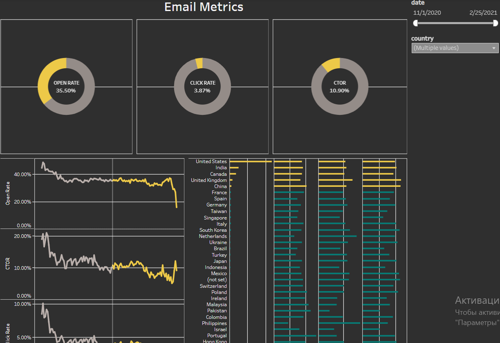

# Email Marketing Analytics Dashboard

## SQL + Tableau | Event-Based Marketing Analysis

### Project Overview

This project analyzes email marketing performance using a relational database and an interactive Tableau dashboard.

The dataset was built from raw event-level tables (email sends, opens, clicks, sessions) and aggregated using SQL to create a reporting-ready dataset.

The goal was to measure engagement, identify geographic performance differences, and analyze trends over time.

### Database Structure

The analysis is based on a relational database containing marketing events, user sessions, and transactional data.

#### Core Entities:

##### Email Events

- `email_sent`

- `email_open`

- `email_visit`

##### User & Session Data

- `account`

- `account_session`

- `session`

- `session_params`

##### Additional Tables

- `order`

- `product`

- `ab_test`

- `event_params`

- `paid_search_cost`

- `revenue_predict`

### Database Schema

### Data Preparation (SQL Layer)

The reporting dataset was created using a SQL aggregation query that:

- Joined email send, open, and click events

- Connected accounts to web sessions

- Enriched data with geographic information (country)

- Aggregated metrics by date and country

- Combined email activity with account activity

#### Key Aggregated Metrics:

- `sent_cnt` — number of emails sent

- `open_cnt` — number of emails opened

- `click_cnt` — number of email clicks

- `account_cnt` — number of active accounts

##### Example of metric calculation:

`count(distinct s.id_message) as sent_cnt`,  
  `count(distinct o.id_message) as open_cnt`,  
  `count(distinct v.id_message) as click_cnt`

##### Final aggregation:

`group by date, country`

### Business Questions

- How does email engagement change over time?

- Which countries show the highest open and click rates?

- Is there a relationship between email activity and active accounts?

- Are there noticeable engagement trends?

### Dashboard Features

The Tableau dashboard includes:

- KPI Overview (Sent, Opened, Clicked)

- Open Rate & Click Rate

- Time series analysis

- Country comparison

- Interactive filters (date & country)

### Email Funnel Logic

The analysis follows a marketing funnel:

Email Sent → Email Opened → Email Clicked → Session Activity

This allows measurement of engagement drop-off between stages.

### Key Insights

Average Open Rate: 35.50%

Average Click Rate: 3.87%

Top performing country: United States

Engagement peaks on November 2020 at the beginning of observing

Some markets show high send volume but low CTR

### Interactive Dashboard

  

[Open Dashboard on Tableau Public](https://public.tableau.com/views/Email_17419564598680/EmailMetrics?:language=en-US&:sid=&:redirect=auth&:display_count=n&:origin=viz_share_link)

### Tools & Technologies

- SQL (BigQuery syntax)

- Relational data modeling

- Data aggregation

- Tableau

- KPI & funnel analysis

### Repository Structure

email-marketing-analytics-dashboard-tableau/  

  README.md  
  
  sql/  
    email_metrics_query.sql  
    
  docs/  
    database_schema.png  
    
  dashboard/  
    email_dashboard.twbx  
    
  screenshots/  
    dashboard_preview.png  

