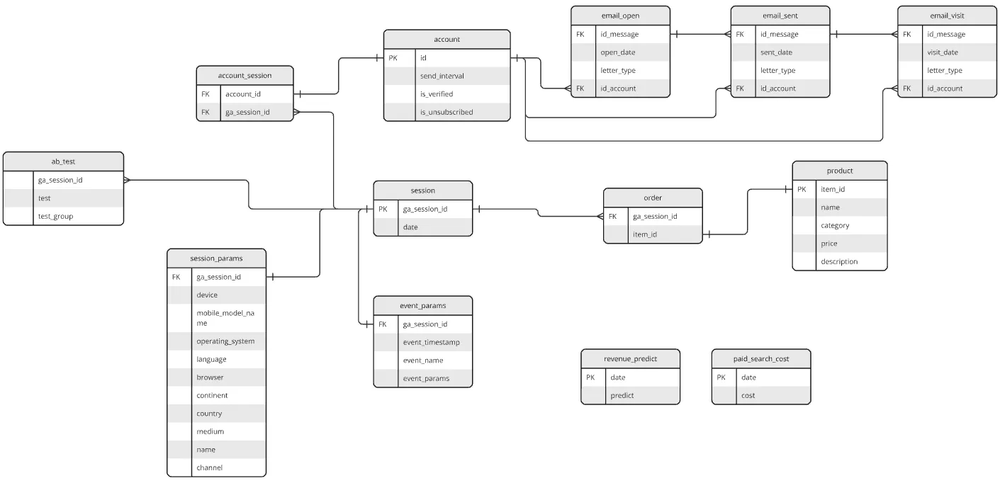
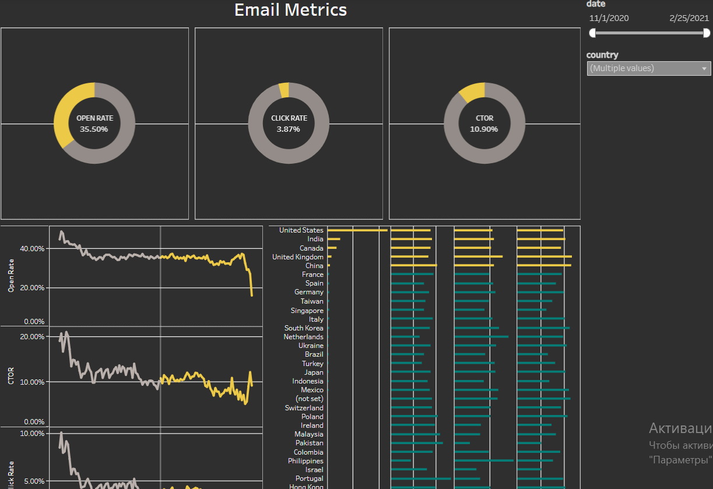

# Email Marketing Analytics Dashboard

## Project Overview

This project analyzes email marketing performance using a relational database and an interactive Tableau dashboard.
The dataset was built from raw event-level tables (email sends, opens, clicks) and aggregated using SQL to create a reporting-ready dataset.
The goal was to measure engagement, identify geographic performance differences, and analyze trends over time.

## Tools & Technologies

- SQL (BigQuery)

- Tableau Public

- Relational data modeling

- KPI & funnel analysis

## Database Structure

The analysis is based on a relational database containing marketing events, user sessions, and transactional data.

**Email Events:** `email_sent`, `email_open`, `email_visit`

**User & Session Data:** `account`, `account_session`, `session`, `session_params`

**Additional Tables:** `order`, `product`, `ab_test`, `event_params`, `paid_search_cost`, `revenue_predict`

### Database Schema



## Data Preparation (SQL Layer)

[View SQL Query](sql/email_metrics_query.sql)

The reporting dataset was created using a SQL aggregation query that:

- Joined email send, open, and click events via `id_message`

- Connected accounts to web sessions via `account_session`

- Enriched data with geographic information (country) from `session_params`

- Aggregated metrics by date and country

- Combined email activity with account creation data using `UNION ALL`

**Key aggregated metrics:**

- `sent_cnt` — number of emails sent

- `open_cnt` — number of emails opened

- `click_cnt` — number of email clicks

- `account_cnt` — number of new accounts

**Calculated in Tableau:**

- Open Rate = `open_cnt / sent_cnt`

- Click Rate = `click_cnt / sent_cnt`

- CTOR (Click-to-Open Rate) = `click_cnt / open_cnt`

## Email Funnel Logic

The analysis follows a marketing email funnel:

`Email Sent → Email Opened → Email Clicked`

This allows measurement of engagement drop-off between stages.

## Dashboard



The Tableau dashboard includes:

- KPI Overview: Open Rate, Click Rate, CTOR

- Time series analysis (Open Rate, CTOR, Click Rate dynamics)

- Country comparison (sent volume, open rate, click rate, CTOR by country)

- Interactive filters (date range & country)

🔗 [Interactive dashboard on Tableau Public](https://public.tableau.com/views/Email_17419564598680/EmailMetrics?:language=en-US&:sid=&:redirect=auth&:display_count=n&:origin=viz_share_link)

## Key Insights

- Average Open Rate: **35.50%**

- Average Click Rate: **3.87%**

- Average CTOR: **10.90%**

- Top performing country by volume: **United States**

- Engagement peaked in early November 2020, at the start of the observation period

- Some markets show high send volume but low click-through rates

## How to Run

1. Clone this repository

2. Open [`sql/email_metrics_query.sql`](sql/email_metrics_query.sql) to review the BigQuery query

3. Explore the [interactive dashboard on Tableau Public](https://public.tableau.com/views/Email_17419564598680/EmailMetrics?:language=en-US&:sid=&:redirect=auth&:display_count=n&:origin=viz_share_link) or download the [`.twbx` file](dashboard/email_dashboard.twbx) to open in Tableau

## Project Structure

```
email-marketing-analytics-dashboard/
├── sql/
│   └── email_metrics_query.sql
├── docs/
│   └── database_schema.png
├── dashboard/
│   └── email_dashboard.twbx
├── screenshots/
│   └── dashboard_preview.png
└── README.md
```
